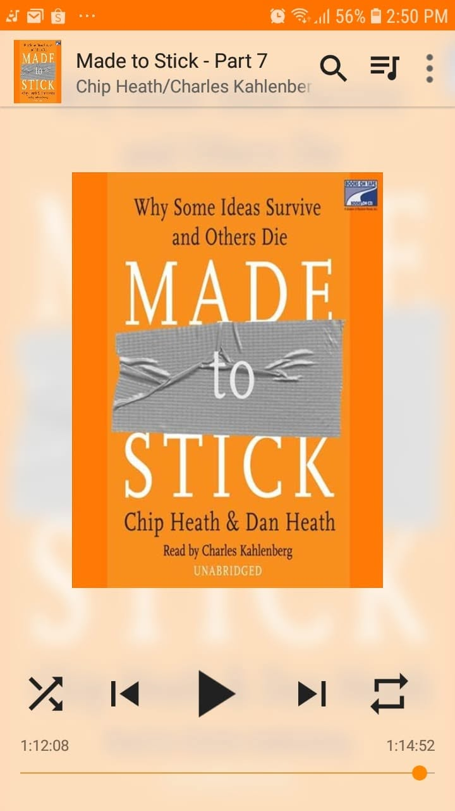

# Libro: Made to Stick

*Made to Stick*, by Chip Heath and Dan Heath

Book 23 of 100

“Simple. Unexpected. Concrete. Credible. Emotional. Stories.”

A pretty neat framework for understanding why some ideas stay with us while others disappear almost immediately.

Ironically, though, I can think of a few other books that probably stuck with me more than this one.

Still, there are some useful ideas here, especially if you’re interested in how to make a message clearer, more memorable, and easier for other people to care about.

Sometimes it’s not enough to simply have a good idea.

You also have to know how to present it.

Strip away the unnecessary parts.

Break the expected pattern.

Make it concrete.

Give people something they can trust.

Make them feel something.

And when possible, tell a story.

If you’re interested in how ideas move from conception to actual lift-off, this is a good place to start. 
