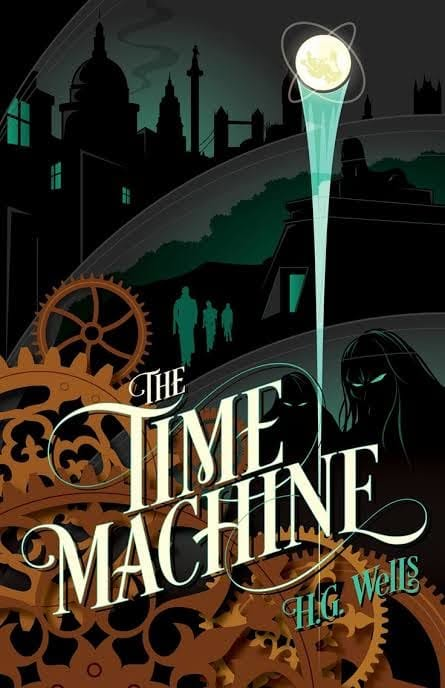

# Libro: The Time Machine

*The Time Machine*, by H.G. Wells
Book 26 of 100

“Face this world. Learn its ways, watch it, be careful of too hasty guesses at its meaning. In the end you will find clues to it all.”

Observe and learn.

That’s probably the simplest takeaway I got from this one.

At first, things may seem disconnected. You see something happen, form an explanation, and convince yourself that you already understand what’s going on.

Then another detail appears and suddenly your first assumption doesn’t make as much sense anymore.

I guess that’s true outside fiction too.

We’re often too quick to assign meaning to things we barely understand.

A person.

A situation.

A failure.

A strange turn of events.

Sometimes the better thing to do is simply watch a little longer.

Gather more clues.

Question your first conclusion.

And learn as the bigger picture slowly reveals itself.

Not everything makes sense immediately.

But there are usually clues.

Find them.

Learn from them.
