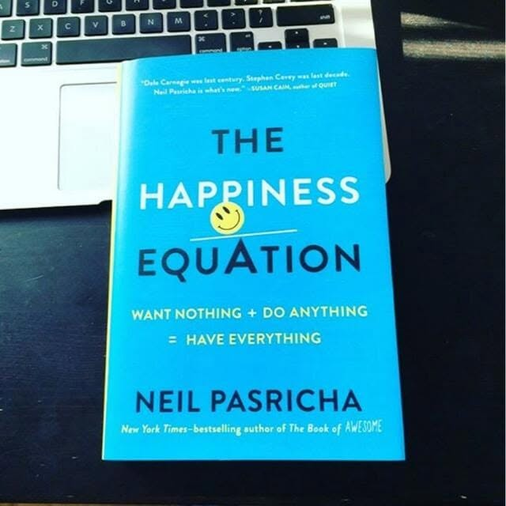

# Libro: The Happiness Equation

*The Happiness Equation*, by Neil Pasricha

Book 27 of 100

“Nobody knows what they want to do with their entire life. Nobody. Nobody is born with a single unifying sense of purpose that they strive to work forever.

Having one giant purpose that you strive to work forever isn’t the goal.

What is?

An **ikigai**.”

A reason to get up in the morning.

I like that idea.

We spend so much of our lives being asked what we want to become, what career we want, where we see ourselves ten years from now, and eventually, when we plan to retire.

As if life is supposed to follow one narrow road with a clearly marked finish line.

Study.

Find work.

Get good at it.

Save.

Invest.

Retire.

Then finally enjoy life.

But what happens after that?

One of the more interesting ideas in this book is that maybe we put too much emphasis on retirement as the ultimate destination. We spend decades imagining the day when we can finally stop working, without thinking enough about what will actually make us want to get out of bed once that day comes.

That’s where **ikigai** comes in.

It doesn’t necessarily have to be some enormous life purpose.

It can change.

It can be your work today, a project tomorrow, your family, something you want to build, something you want to learn, or simply something that makes you look forward to another morning.

And maybe that’s a healthier way to look at life.

Prepare for your future, definitely.

Save. Invest. Build enough freedom for the version of yourself that comes later.

But don’t spend your entire present waiting for some imaginary finish line before giving yourself permission to enjoy living.

There is no single destination that all of us are supposed to reach.

There isn’t one narrow street.

You can spend your life waiting for retirement so you can finally do the things you enjoy.

Or you can wake up every morning and keep finding reasons to enjoy the life you’re already living.

Lastly, you don’t live only once.

You **die** only once.

You live every day.

So when you get out of bed tomorrow morning, maybe ask yourself:

**What’s my ikigai?**
