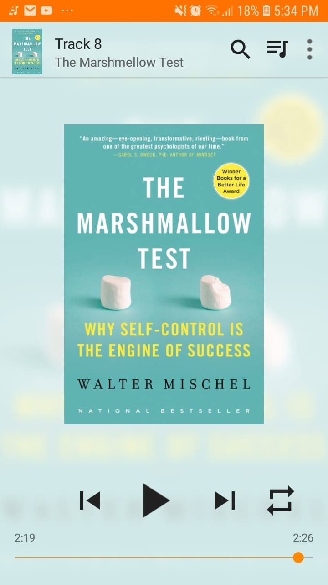

# Libro: The Marshmallow Test

*The Marshmallow Test: Mastering Self-Control*, by Walter Mischel
Book 28 of 100

“We do not come into the world with a bundle of fixed, stable traits that determine who we become. We develop in continuous interactions with people and experience.”

The idea behind this one is genuinely interesting.

How much does self-control at a young age influence the kind of person we eventually become?

How much of it is something we’re born with, and how much can actually be shaped by experience, environment, and the people around us?

There are definitely some useful insights here, especially around delayed gratification, willpower, and the idea that self-control is not necessarily a fixed trait.

That said, I felt like the main ideas were buried under a little too much psychobabble.

There were moments when I thought:

**Okay, I get the point. Can we move on now?** 

So yeah.

Good read, interesting concept, but definitely a bit of a struggle to finish.

When it comes to willpower, habits, and changing behavior, I’d still personally go with Charles Duhigg’s *The Power of Habit*. 
