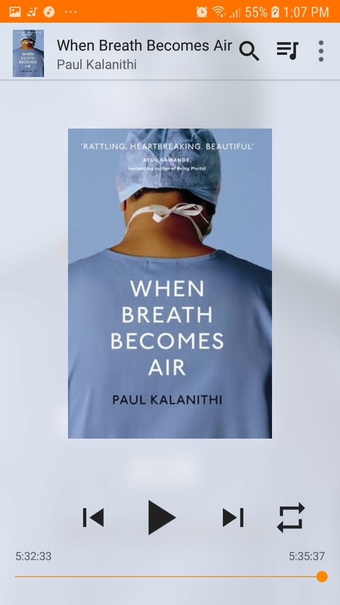

# Libro: When Breath Becomes Air

*When Breath Becomes Air*, by Paul Kalanithi
Book 33 of 100

“We are never so wise as when we live in the moment.”

This is the kind of book that grips you quietly and doesn’t really let go until the last page.

What stayed with me most was the shift in perspective.

From medicine as something procedural, clinical, and structured, to suddenly being on the receiving end of it.

From being the physician making decisions to becoming the patient depending on those same decisions.

That change alone gives the book a different kind of weight.

It’s one thing to understand illness through charts, scans, diagnoses, and treatment plans.

It’s another thing entirely when the person being discussed is you.

There are a lot of lessons packed into this one about work, purpose, mortality, family, and what it means to live when time suddenly becomes uncertain.

But one thought stood out to me the most:

“We might not always be able to understand what everyone goes through, but we can set aside the time to listen to their story and hopefully give them respect as a human being, in life or death.”

Maybe we won’t always know the right thing to say.

Maybe we won’t fully understand what another person is carrying.

But sometimes listening is already a form of kindness.

And sometimes respect begins simply by remembering that behind every diagnosis, every chart, every problem, and every difficult moment, there is still a person.
