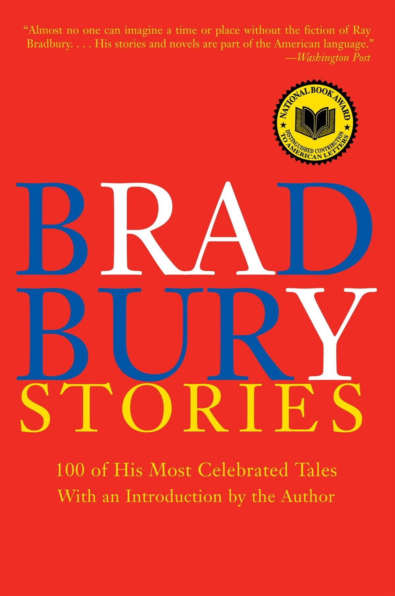

# Libro: Bradbury Stories: 100 of His Most Celebrated Tales

*Bradbury Stories: 100 of His Most Celebrated Tales*, by Ray Bradbury
Book 43 of 100

“The world is full of statues.”

A light dive into the mind of a master storyteller.

What I liked about this collection is how easily Bradbury moves from the ordinary to the strange.

One story can feel nostalgic and familiar, then the next one suddenly throws you into something eerie, surreal, or completely unexpected.

And somehow, even the weirdest stories still feel human.

Fear.

Memory.

Curiosity.

Regret.

Hope.

The kind of things that keep showing up no matter how strange the setting gets.

Reading through a collection this big also makes you notice how much of storytelling is simply about paying attention.

A place.

A person.

A small detail.

An odd thought.

Then asking: **What if?**

Sometimes that’s all a story needs to begin.

A good reminder that imagination doesn’t always come from looking somewhere far away.

Sometimes you just need to look harder at what’s already around you.
