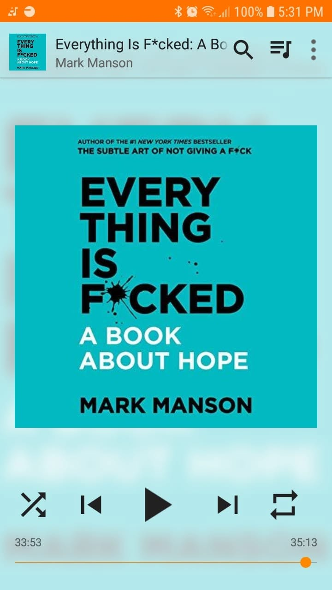

# Libro: Everything Is F*cked

*Everything Is F*cked: A Book About Hope*, by Mark Manson
Book 40 of 100

“Early in life, we are driven to explore the world around us, to know what is worth pursuing further and what is worth avoiding.

The exploratory phase eventually exhausts itself and not because we ran out of world to explore. 

Or maybe, it’s the opposite.

The exploratory phase wraps up because as we become older, we begin to recognize that there’s too much world to explore. You can’t touch and taste everything. You can’t meet all the people.”

If there’s one thing I can say about Manson, it’s that he has a pretty good way of capturing human psychology while still sounding like someone who would rather tell you the uncomfortable truth than dress it up nicely. 

There’s a lot packed into this one.

Why people behave the way they do.

Why emotions often beat logic.

Why we keep repeating the same mistakes even when we already know better.

How our actions eventually turn into consequences, whether we like them or not.

And, of course, hope.

That last part is probably what I found most interesting.

For a book with “hope” in the title, it doesn’t exactly hand you a warm, comforting answer by the end.

If anything, I felt a little left to dry by the open-endedness of it.

But maybe that fits the point.

Hope isn’t always about convincing yourself that everything will turn out fine.

Sometimes it’s about accepting that things can be messy, uncertain, even completely fucked, and still deciding that there’s something worth doing next.

If you haven’t read Manson before, I’d start with **The Subtle Art of Not Giving a F*cked**.

Then read this one.

It feels like the natural next step.
