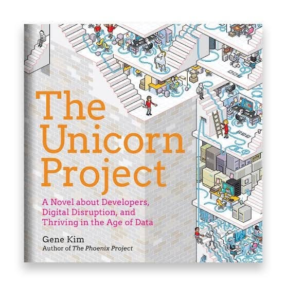

# Libro: The Unicorn Project

*The Unicorn Project*, by Gene Kim

Book 2 of 100

“It’s not the upfront capital that kills you, it’s the operations and maintenance on the back end.”

I started out closer to Ops, spent time learning what happens behind the scenes, and eventually moved into installation and implementation.

I guess one of the best things about getting exposed to different parts of a tech environment is that you slowly start to understand how much each role depends on the others.

Developers build.

Operations keeps things running.

Infrastructure provides the foundation.

Support handles the problems that somehow still make it through.

And somewhere in between, all of those people have to figure out how to work together.

It doesn’t always fit perfectly.

Processes clash.

Priorities differ.

One team’s improvement can easily become another team’s problem.

But somehow, all those imperfect pieces still have to fit into the same puzzle.

And I think that’s what I enjoyed most about *The Unicorn Project*. It gives you another perspective on how software, systems, people, and processes all affect each other.

For developers: *The Unicorn Project.*

For network and systems engineers: *The Phoenix Project.*

Different sides of the same machine.

Now, looking forward to finally getting my hands on *The DevOps Handbook*. 
