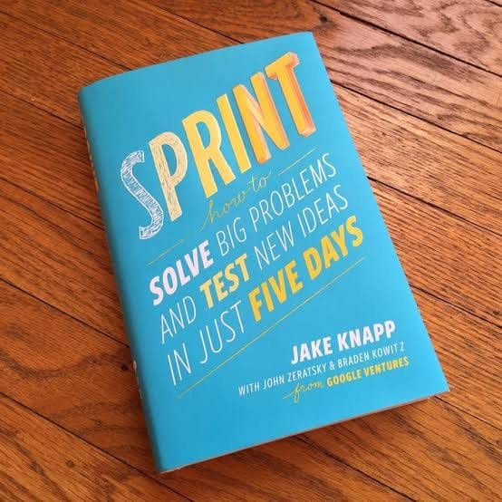

# Libro: Sprint: How to Solve Big Problems and Test New Ideas in Just Five Days 

*Sprint: How to Solve Big Problems and Test New Ideas in Just Five Days*, by Jake Knapp, John Zeratsky, and Braden Kowitz
Book 4 of 100

“One part is mindset, the second half is method.”

This one packs a lot into a pretty simple idea:

You don’t always need months of meetings, planning, and endless discussion before finding out whether an idea actually works.

Sometimes you just need a focused process, a small team, a clear problem, and a way to test something quickly.

A lot of the concepts felt familiar, especially if you’ve already been exposed to process improvement, design thinking, Lean, Agile, or Scrum.

So I wouldn’t say every idea here feels completely new.

But that’s not really a bad thing.

What *Sprint* does well is bring many of those ideas together into a practical framework. Instead of spending too much time debating what *might* work, you build something, put it in front of people, gather feedback, and learn from what actually happens.

Less guessing.

More testing.

Less talking about the perfect solution.

More finding out whether the damn thing works. 

Definitely a good supplemental read for anyone exploring Lean, Agile, Scrum, or design thinking.
