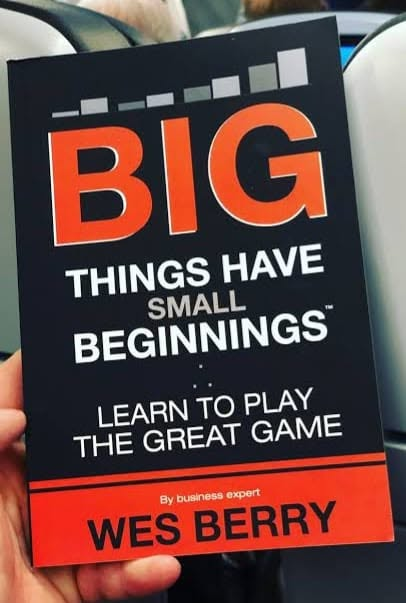

# Libro: Big Things Have Small Beginnings

*Big Things Have Small Beginnings: Learn to Play the Great Game*, by Wes Berry

Book 5 of 100

“Ambitious people become dangerous if they get their ambitions checked, and not the other way around; if they are left to roam free, they become productive and useful.”

The title pretty much says it all.

Big things usually don’t start big.

They start with small decisions, small risks, small improvements, and a lot of ordinary work that doesn’t look impressive while you’re doing it.

That’s probably the part we forget.

We tend to notice the result once it becomes visible, but not the countless little things that had to happen before it got there.

And ambition works the same way.

Wanting something bigger for yourself isn’t necessarily a bad thing. What matters is what you do with that ambition.

You can let it turn into frustration when things don’t move fast enough.

Or you can put it to work.

Learn.

Build.

Try.

Fail.

Adjust.

Then keep going.

As they say, take care of the small things and the big things have a way of taking care of themselves.

So, are you ambitious enough? 
