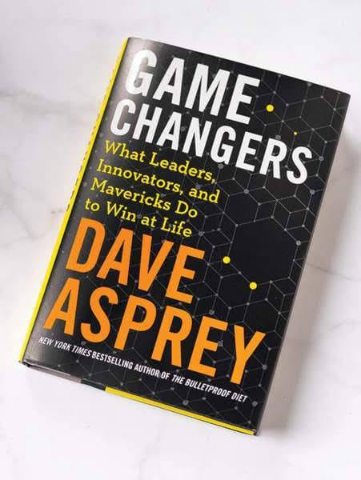

# Libro: Gamechangers

*Game Changers*, by Dave Asprey
Book 5 of 100

It’s good to be back.

“A flexible mind changes itself and builds a better model as it gathers more data about reality.”

A lot of the ideas in this book are already familiar.

Sleep better.

Eat better.

Move more.

Manage stress.

Take care of yourself.

Nothing exactly revolutionary there.

What I didn’t expect, though, was how much the book would keep circling back to something we often neglect when we’re trying to improve ourselves:

**The body.**

We spend so much time thinking about productivity, mindset, discipline, learning, and becoming better at what we do that it’s easy to forget the thing carrying us through all of it.

You can read all the books you want, build better habits, optimize your schedule, and push yourself harder.

But if your body is constantly tired, stressed, or running on empty, eventually everything else starts feeling harder too.

Maybe self-improvement doesn’t always begin with doing more.

Sometimes it starts with taking better care of what’s already there.

So yeah.

**A sound mind, a sound body.** 
