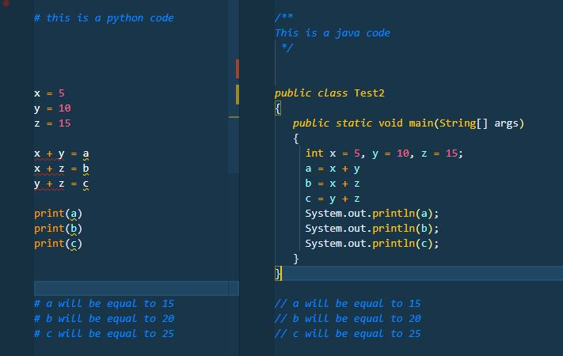
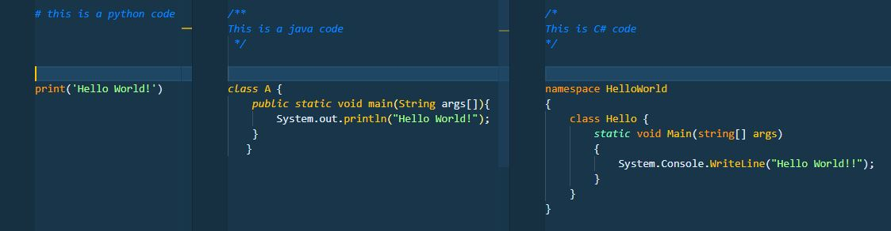
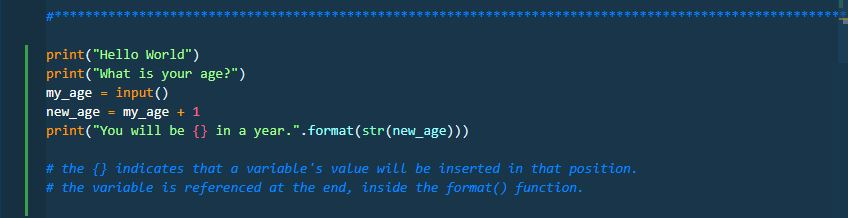
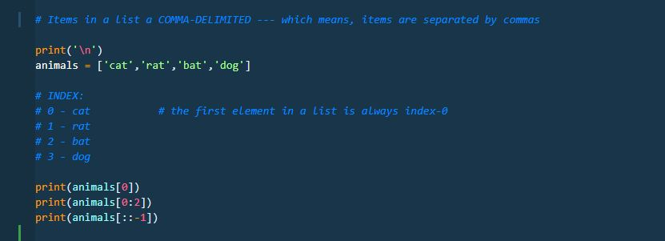

# Programming is easy, ain't it?

> My take on how I approach the idea of programming.
> I've also included some of the core concepts that I think everyone should know when they're starting to dive into coding.

To start with, I want to say that you made the right choice opening this post.

You might be someone who's been dabbling with code since you were little, or maybe you're someone who just wandered through a bunch of interesting links on Google and somehow found yourself craving more nuggets about programming.

Either way, there's probably still one thought, or rather one question, sitting somewhere in your mind:

***Is programming really easy?***

Well, let's try to answer that question once and for all.

**Programming is relatively easy.**

Say it with me.

Yes, for the most part, programming is basically putting together keywords and instructions into lines that the computer can understand, then moving on to the next line.

Kind of like forming a sentence.

But is it really just that?

Think about how you form a sentence in English. There are certain rules you have to follow. You have to think about which tense to use, whose point of view you're writing from, where words should go, and which punctuation mark should end the sentence.

Programming works in a similar way.

You have a set of rules, a vocabulary, and a structure that you need to follow.

Of course, there are a few other core concepts you should understand before you start building your own programs.

## What's the word?

When you're first learning a new language, let's say Nihongo, you might have this reaction the first time you come across Kanji:

**Looks complicated, must be complicated.**

But it's really not that difficult once you take the first few steps and start learning the basics.

Everything can be confusing and frustrating when you're doing it for the first time. But once you start breaking down the individual pieces and understanding how they work together, things slowly begin to make sense.

And eventually, it becomes easy peasy.

### What came before

Regardless of which programming language you're trying to learn, you'll notice that many of them share similar ideas.

Programming languages are usually created to solve certain problems, introduce new ways of doing things, or improve on limitations found in languages that came before them.

Because of that, newer languages often borrow concepts, techniques, and even syntax from older languages.

They won't all work exactly the same way, of course, but once you've learned the fundamentals of one language, you'll probably recognize a lot of familiar concepts when you move on to another.

So I guess you could say that programming languages speak differently, but many of them think in similar ways.

## At their core

As I've mentioned, many programming languages share the same basic concepts. The main difference is often how those concepts are written or implemented.

Here are some of the things you'll encounter almost everywhere.

* **Syntax**

  Remember that every language has its own rules.

  These rules might be influenced by earlier languages, but each language will still have its own way of writing instructions.

  

  When you first read the title of this post, you might have had this tiny feeling that something was a little off about how it was written.

  If you did, then congratulations. You already understand the basic idea of syntax.

  Syntax is basically the set of rules that tells you how something should be written.

  Now, ***programming is indeed easy, isn't it?*** 😄

* **Variables**

  The main idea behind variables is associating a value with a name.

  Think of a variable as a labeled container where you can store information and use it later.

  These values can be changed, passed around, compared, calculated, printed, and used throughout your program.

  For example, instead of repeatedly writing a person's age as `25`, you could assign that value to a variable called `age`.

  From that point on, your program can simply refer to `age` whenever it needs that value.

  

* **Printing**

  Printing is basically telling your program to display something as output.

  This could be the result of a calculation, the value stored in a variable, a message, or pretty much anything you want the user or programmer to see.

  You might hear programmers say something like:

  "*The code returned this value.*"

  What they usually mean is that after the program processed its instructions, it produced some sort of result.

  But programs don't always display those results automatically.

  Sometimes the calculation is happening quietly in the background, and if you want to see the result, you need to explicitly tell the program to print or display it.

  You've probably already seen a glimpse of this in the example for variables above.

    

* **Comments**

  Comments are notes that programmers leave inside their code.

  Their purpose is to explain what a certain section does, why something was written in a particular way, what a variable represents, or anything else that might be useful to someone reading the code later.

  And yes, that someone could very well be you six months from now wondering:

  "*Why the hell did I write this?*"

  Comments aren't processed as instructions by the program.

  Different programming languages have different ways of marking comments.

  In Python, for example, you can put a **#** at the beginning of a line to tell Python that the line is a comment and should not be executed.

  

* **Strings**

  Earlier, we talked about comments and how Python recognizes a line beginning with **#** as something that shouldn't be executed.

  But what if you actually want your program to work with words or sentences?

  That's where strings come in.

  A string is basically text stored as data.

  

  When you assign text to a variable, you'll normally wrap it in quotation marks so the programming language knows that it's dealing with text rather than another instruction.

  You can also combine strings with other values through formatting.

  For example, if you have a variable containing someone's name, you can insert that value into a sentence rather than writing the name manually every time.

* **Arrays**

  An array is basically a collection of values grouped together.

  Instead of creating a separate variable for every single piece of information, you can store several related values in one collection.

  Depending on the programming language, collections like these can contain numbers, strings, objects, or even other collections.

  Python, for example, commonly uses something called a **list** for this purpose.

  
  
  Another important thing to understand is that values inside these collections have positions.

  So if you only want one particular value, you don't necessarily have to retrieve everything. You can refer to its position, usually through something called an **index**.

  For example, if you have a list containing five names and you only need the first one, you can access that specific item directly.

  And here's one thing that might feel strange at first:

  In many programming languages, counting starts at **0** instead of **1**.

  Welcome to programming.

## Wait, there's more

At this point, hopefully you have a better idea of why I say programming is relatively easy.

A lot of people focus immediately on the question:

***Which programming language should I learn first?***

And that's perfectly fine.

But I think what's more important is understanding the concepts that programming languages have in common.

Once you understand ideas like variables, syntax, strings, collections, conditions, loops, and functions, moving between languages becomes much less intimidating.

The syntax might change.

The keywords might change.

But the general ideas are often still there.

If you'd like to learn more about some of the things you can explore before diving fully into programming, you can check out Evan Kimbrell's Udemy course, [Pre-Programming: Everything you need to know before you code](https://www.udemy.com/course/pre-programming-everything-you-need-to-know-before-you-code/).

You can absolutely jump straight into whatever programming language you're interested in.

But if you're someone who's non-technical and you've only recently developed an interest in programming, I think learning some of these basic ideas first can make the whole thing feel a lot less overwhelming.

Because programming itself isn't really the scary part.

The difficult part is usually figuring out what you want the computer to do and breaking that problem down into instructions it can understand.

Once you get used to doing that, the code starts making a lot more sense.

As always, happy learning!
