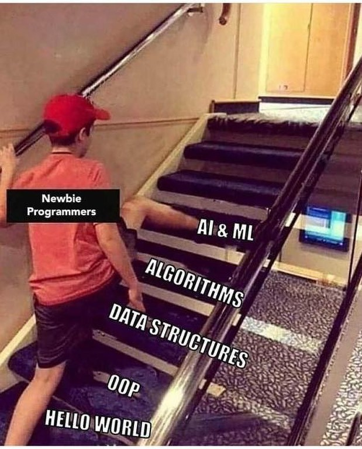
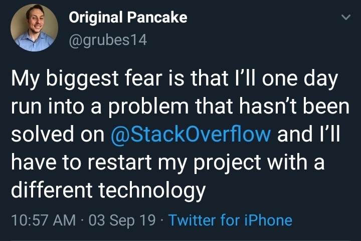

# Day 1 - Where to start?

**DAY 1 - Where to start?**

The #100DaysOfCode challenge has been one of those goals that I've pushed back several times in the past, either because of time constraints or some looming workload I had to deal with.

There were actually a few times when I started the challenge, only to stop after a week because, well, I simply didn't know enough yet.

What I mean is that my way of learning was never really structured. Instead of going through the fundamentals of a skill, I would usually jump straight into whatever was necessary to solve the problem in front of me.

And sure, that's an efficient way to get things working quickly. But it's not really sustainable. Eventually, the lack of foundation catches up with you.

You might manage to solve one problem, but once something breaks again, you suddenly realize you don't fully understand why the solution worked in the first place.

## You just cannot skip the process

Another thing that has always gotten in the way is my own thought process.

I was younger then, with little experience but a lot of excitement and tenacity to jump into challenges without first going over what was actually needed.

I'm telling you, as a kid, it was fun to just tackle whatever the world threw at you because, well, that's how kids deal with things. No BS. No need to complicate things. Just plain fun.

But as an adult (or at least a 20-something adult) you can't always just grab a problem and try to solve it without examining it carefully first. For one thing, there are consequences to our actions.

No matter how small we think an effect might be, the real problem starts when those effects begin to cascade and roll downhill like a snowball on a steep mountain.

One day, you think you don't need to learn data structures and algorithms because you've already managed to put together a script patched from several sources on the internet.

Then the next day, you come face-to-face with a problem that nobody has asked on Stack Overflow yet.

You just cannot skip the process.

It might feel like it takes more time to properly learn something, but hey, you don't move mountains using brute force. Instead, you break Everest into its smallest pieces and move it one stone at a time.

## Moving places

I've hopped into positions where I was either only partially qualified or, honestly, not qualified at all.

I guess it was the eagerness and tenacity that helped me get those jobs, but I've learned that the basics always come back eventually. You'll be troubleshooting some issue, and suddenly you're back on the internet searching for the fundamentals again.

Alright, maybe I'm exaggerating a little when I say that I never bothered learning the fundamentals of anything.

I did start from the very basics of networking when I re-learned everything while studying for my CCNA last year. It was actually a fulfilling experience to properly understand subnetting, how networks work, and how routing allows data to reach its destination.

But I also know that networking is just one of the foundations an IT professional should have.

And as I discover more about the world of DevOps, I've come to accept that networking alone isn't enough if I really want to succeed as a DevOps or cloud engineer.

Which is why I started learning Linux last February.

That turned out to be pretty useful when I moved to my current job, where I handle some of our network management systems. Those NMS tools are all hosted on Red Hat 7 Linux servers, which I've been lucky enough to play around with.

Well, mostly on the lab servers.

Practicing on production servers is obviously a BIG NO.

Alright, I guess that's enough of the story, and the memes.

I've already spent about an hour researching what I'll focus on for this challenge and, of course, looking for the awesome memes I'll put in here.

So far, I've narrowed my checklist down to this:

1. **Standardize my naming conventions** - Yeah, I know this sounds like a pretty trivial thing, but I think it'll help in the long run, especially if I ever come back and look through my earlier files.

2. **Linux** - I still consider myself relatively new to Linux, but I'm definitely more comfortable working on Linux servers and my Linux VMs now. It's only been a couple of months since I first really dove into Linux, so there's still a lot to learn.

   Another good playground for Linux is KodeKloud. Head over to [www.kodekloud-engineer.com](http://www.kodekloud-engineer.com/), set up an account, and try completing your first System Admin task.

3. **Git** - I already have a Git account, and I've learned how to work with my local repositories, but what I don't really know yet is how to properly work with GitHub.

   So yeah, Day 1 is for Git and GitHub.

   For this, I'll be using a Coursera Guided Project called *Git for Developers Using GitHub*, which you can find here:

   https://www.coursera.org/learn/git-for-developers-using-github/

4. **Python** - With so many languages to choose from, I decided to lock myself into Python for, I guess, the first 50 days.

   This will include solving problems on HackerRank and actually working on projects.

   Python is a language that's pretty close to me because I've had this on-and-off relationship with it for a while now. There are periods when I'll focus intensely on doing Python stuff, and then suddenly stop because there's another workload I need to deal with or because I'm preparing for another certification exam.

   This time, I want to be more consistent.

   I'll be using the Google IT Automation with Python Professional Certificate on Coursera:

   https://www.coursera.org/professional-certificates/google-it-automation

## Google IT Automation with Python Professional

To start re-learning Python the proper way, I'm beginning with the *Google IT Automation with Python Professional Certificate* on Coursera, which is composed of six courses.

The site suggests that it can be completed within eight months if you spend around four hours per week studying.

Since I plan to work on this every day, including weekends, and because I normally watch the videos at 2x speed, I'm aiming to finish the entire professional certificate in around two months.

What I really want to spend more time on, though, are the practice challenges.

Now, this is still a rough plan.

If you've read the Python section above, this is only what I'm planning for the first half of the 100 days.

For the second half, I intend to work on web development stuff.

You might say that 50 days is too short to finish that course.

And yeah, you're probably right.

I'll just finish whatever I can between Day 50 and Day 100. Whatever is left, I'll continue during my next #100DaysOfCode.

To sum it all up, I guess this #100DaysOfCode challenge is really more of a consistency challenge for me.

I'd like to fully commit myself to something and keep going until I reach some level of mastery.

Of course, it'll take way more than 100 days to become an expert at something. But I think these 100 days can at least put me on the right path.

Also, I'm still not really sure where I'll be posting all of this since I only recently started Twitter and Instagram accounts.

I guess I'll use both.

The problem with Twitter is the character limit, so I might have to break the posts into parts, maybe post the first half as the main tweet and continue the rest in replies.

Or I could just cross-post everything to dev.to or Hashnode.

My only concern is whether all the images I put here will display properly when I post on those platforms.

As for Instagram...

Yeah, I haven't really figured that one out yet.

And one last thing: my succeeding posts or tweets will probably be a lot shorter than this one. They'll mostly just be updates on how the challenge went that day.

Then maybe at the end of every month, I'll create a longer summary as a checkpoint and post it on dev.to, Hashnode, or freeCodeCamp.

Alright.

So, Day 1. Where to start?

Yeah.

**Git.**
