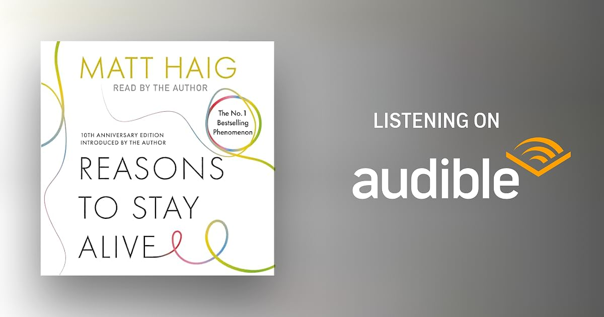

---
slug: reasons-to-stay-alive
title: "Reasons to Stay Alive"
tags: [Books]
date: 2021-05-24
hide_table_of_contents: true
---

# Libro: Reasons to Stay Alive

*Reasons to Stay Alive*, by Matt Haig

“There is this idea that you either read to escape or you read to find yourself. I don't really see the difference. We find ourselves through the process of escaping.”

I didn’t expect to pick this one up right after a stack of non-fictional books. I think sometimes a book just finds you when you need it.

----------------------------------------------

This book sounds a bit...about depression and anxiety, but without sounding like a clinical textbook. It reads more like someone who survived the storm and is sitting across a coffee table telling you what it felt like.

The first half dives straight into the heavy stuff. It covered panic attacks hitting out of nowhere and the exhaustion of pretending everything is fine. It talks about how depression lies to you, and makes you believe the pain is permanent and convinces you that nothing will ever feel light again.

Then the book shifts gears. It then turns into a practical, comforting list of things that kept him anchored:

1. Reading books to escape his own head.
2. Drinking coffee and walking outside.
3. Remembering that time moves forward even when you feel frozen.

I think, it is not an exact magic fix with five-step rules. It is just a reminder that you do not have to figure out your entire life today. 

You just have to survive today.
