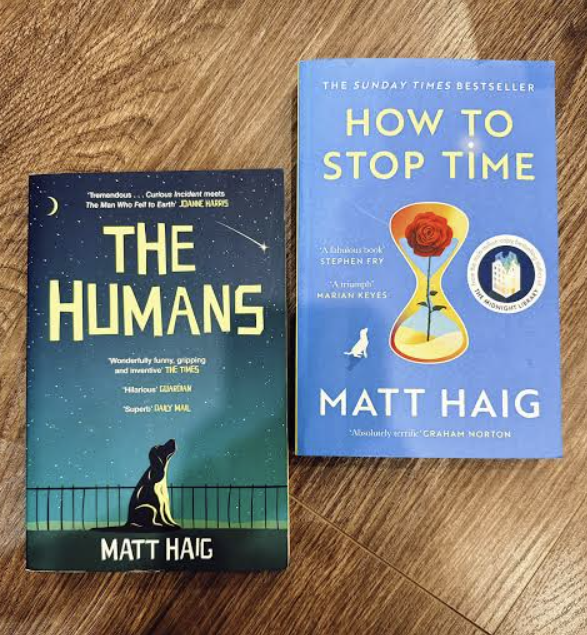

# Libro: The Humans 

*The Humans*, by Matt Haig

“To be a human is to state the obvious. Repeatedly. Over and over, until the end of time.”

### My personal takeaway:

So much of what makes life actually worth living doesn't make a lick of logical sense.

And I think that's completely fine.

### What does it actually mean to be human?

If you look at us through the eyes of an alien, humanity is honestly kind of funny.

We spend half our lives wearing clothes we find uncomfortable, stressing out over money, and nodding politely while pretending we actually understand each other.

Oh, and having a profoundly unhealthy relationship with peanut butter (you need to read the book to get this, lols)

### The Premise:

Professor Andrew Martin figures out a massive mathematical breakthrough that humans apparently aren't supposed to unlock yet.

So, naturally, an interstellar visitor gets sent down to Earth to take his place, erase the evidence, and tie up any loose ends.

At first, he is completely repulsed by us.

Our bodies, our faces, our food, everything we do just seems utterly pointless to him.

Then he actually has to step into Andrew's shoes and live his life.

He meets Andrew's wife, Isobel.

Their son, Gulliver.

A dog named Newton.

Along the way, he stumbles into music, poetry, good food, real relationships, and all those tiny, mundane things that don't seem important at all until you meet someone who has never experienced them.

And that's where the book really became interesting to me.

The alien comes from a society that is light-years ahead of us technologically.

But the longer he stays here, the more he realizes that being human isn't about being efficient or superior.

We're messy. 

We're irrational.

We get overly attached. 

We worry over stupid stuff.

We manage to hurt each other even when we mean well.

Yet, even though we know people and things won't last forever, we still choose to care anyway.

Naturally, his mission gets a whole lot more complicated than he bargained for.

---

Oh, and if you've already read *The Humans* and liked it, you might want to check out some of Matt Haig's other stuff:

- Reasons to Stay Alive
- How to Stop Time