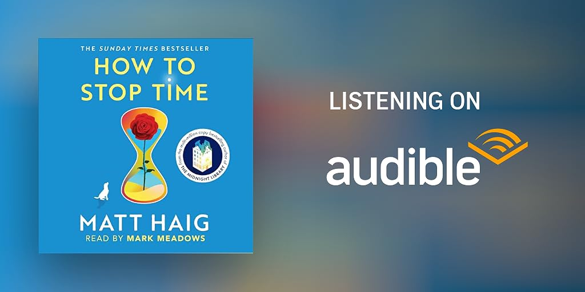

# Libro: How to Stop Time

*How to Stop Time*, by Matt Haig

How to stop time? Kiss. 

How to travel in time? Read. 

How to escape time? Music. 

How to feel time? Write. 

How to release time? Breathe.

Imagine being alive for over four hundred years, walking through history, and just wanting to live a normal, quiet life. 

That is story of the book's main protagonist: Tom Hazard.

He has a rare condition that makes him age once every fifteen years, meaning he has technically lived since Elizabethan England.

The catch is the Alba Society, a secret group protecting his kind, which enforces a few strict rules:

- Do not fall in love.
- Do not build deep roots.
- Move every eight years or risk exposure.

----------------------------------------------

After going through the entire book, I've realized a couple of things.

We spend so much time worrying about the future or wishing we could change the past. 

You end up realizing how easy it is to stay trapped behind your own history.