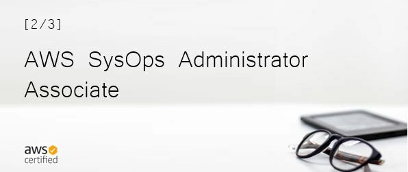
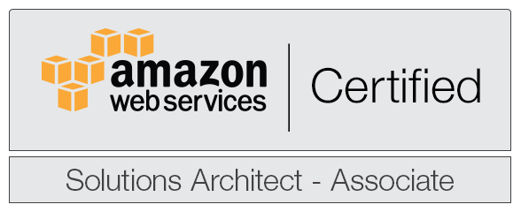

# The Examination Day

> Sharing my notes and thoughts about the **AWS SysOps Administrator Associate Exam**.

Before anything else, I'd like to say that it is ***extremely helpful*** to take the **AWS Solutions Architect Associate Exam** first before diving into the other two Associate exams, SysOps Associate and Developer Associate.

Taking the Solutions Architect exam first gives you a good sense of how the different AWS services work, how they connect with each other, and how they're used when building solutions.

Just like with any skill, I think it's important to start with the basics.

Learn the theory.

Play around.

Break things.

Then try to fix them afterward.

Once you have a good grasp of how solutions are architected, you can start learning how to operate and maintain them.

And that's where the **AWS SysOps Administrator Associate** comes in.

For a bit of background, I started my career in IT networking, where I handled routers, switches, and network management tools.

I also had a short stint in application support at a FinTech company, and in my previous job I had the chance to work with Linux servers as well.

All in all, I'd say I'm more of an infrastructure guy with a bit of programming mixed in.

I'm still very much a work in progress, though.

There are definitely a lot of technologies that I still have to learn, so I've been trying to expose myself to as many Linux and Python projects as possible.

Automation is still a relatively new concept to me, but I'm slowly getting more comfortable creating my own scripts and processes.

My AWS journey actually started with the **AWS Cloud Practitioner Exam** last August.

Then, 29 days later, I sat for the **AWS Solutions Architect Associate Exam**.

After that, I set my sights on SysOps.

Unfortunately, there were other things at work that needed my attention at the time, so I had to park my SysOps studies for a while.

I resumed reviewing around January to February and decided to start posting my notes on my GitHub account.

Around the same time, I also had some personal challenges brewing at home, which slowed me down for a bit.

Still, I tried to gather myself, push through with the mission, and set a goal to take the exam by March.

Little did I know that I'd end up pushing it back for another two months.

On my first attempt, I ran into problems with my internet connection, and the proctor cancelled the exam while I was waiting for the test window to load.

I had already taken several online certification exams through **Pearson VUE** before, but this was the first time an exam was closed without the proctor informing me first.

I reported the issue, and after about four days, they refunded both the exam fee and the voucher I had used.

Since I was a bit tight on budget, I waited for the refund to come through before scheduling my second attempt.

Then came May 24.

I prepared my desk at home, cleared my mind, and sat down for the exam.

I was honestly praying hard for everything to work properly this time because I had already spent so much time preparing for it.

After around 48 minutes, I submitted the 65th question.

A few more clicks later, the result finally flashed right in front of me.

**RESULT: PASS**

And man, that's some sweet-tasting bacon.

## Notes that might help you

Of course, there's a good chance you found this post while searching for notes and tips on how to prepare for the **AWS SysOps Administrator Associate Exam**.

So yeah, I'm putting those here too.

You can find my GitHub notes [here](https://github.com/joseeden/notes-aws-sysops).

Be sure to check out the [summary notes](https://github.com/joseeden/notes-aws-sysops/tree/master/Notes) as well.

For the materials, these were the ones I focused on:

* [Ultimate AWS Certified SysOps Administrator Associate 2021](https://www.udemy.com/course/ultimate-aws-certified-sysops-administrator-associate/)
  by Stephane Maarek

* [\(NEW\) AWS Certified SysOps Administrator Associate 2021](https://www.udemy.com/course/aws-certified-sysops-administrator-associate-training/)
  by Neal Davis

* [AWS Certified SysOps Administrator Associate Practice Exams 2021](https://portal.tutorialsdojo.com/product/aws-certified-sysops-administrator-associate-practice-exams/)
  by Tutorials Dojo

* [Official AWS Documentation](https://docs.aws.amazon.com/)

* [AWS SysOps Administrator Associate Exam Guide](https://aws.amazon.com/certification/certified-sysops-admin-associate/)

## How to start

I'd suggest starting with either Stephane Maarek's course or Neal Davis's course.

Honestly, you should already get a lot out of finishing just one of them.

I went through both because they have slightly different approaches, and I liked the idea of having one course fill in whatever details I might have missed from the other.

But don't just watch videos.

Make sure you actually spend time inside the AWS console.

I think it's a **definite must** to become familiar with the different tabs, options, menus, and settings because actually seeing and using them helps cement the concepts you're learning from the courses.

And besides simply following the labs, try breaking some of the things you've built.

Seriously.

Break them.

Then figure out how to fix them.

That way, you're not just memorizing steps from a tutorial. You're also training yourself to troubleshoot, search through documentation, and put your Google-Fu to good use.

Once you've finished the course and you're comfortable moving around the AWS console, you can move on to practice exams.

You can try the practice exams from Maarek and Davis, which are also available on [Udemy](https://www.udemy.com/), and pair them with the practice tests from [Tutorials Dojo](https://tutorialsdojo.com/).

One thing I really liked about the Tutorials Dojo exams is that each question comes with an explanation of both the correct and incorrect answers.

Don't just memorize which option is correct.

Read the explanations.

Understand why one answer works and why the others don't.

There are questions where more than one answer might look reasonable at first, so understanding the differences between the choices is really important.

Lastly, supplement the courses and practice tests with the official AWS documentation.

Of course, you won't be able to read every single page of documentation for every AWS service.

You'll probably lose your mind trying.

But reading the official docs for the services and concepts you're struggling with can definitely help fill in the gaps.

## FINAL THOUGHTS

I actually thought about putting this section at the very top because I think this is something you should figure out before you even start studying.

Ask yourself all these questions.

### Why do you want to take the exam?

Maybe it's for career progression.

Maybe you want to learn a new skill.

Maybe you're trying to break into a cloud role.

Maybe you're just genuinely curious about AWS.

Whatever your reason is, I think it's important to know it because that reason will shape how you approach the whole learning process.

### Do not go through the exam just for the sake of getting the certification or the badge

A certification is nice to have, but in any cloud role, you'll eventually have to back it up with actual skills and experience.

And the only real way to do that is to build something.

It doesn't have to be huge.

It doesn't have to be some crazy production-ready architecture with twenty AWS services.

Just build.

Break things.

Fix them.

Try something again.

Get your hands dirty.

I'm still on that same quest myself, trying to expose myself to as many cloud technologies as possible.

And it'll be great to have more people jumping on the same train ride.

### Learn for the sake of learning

Learn because you're extremely curious about something.

Learn because there's something you don't understand yet and you want to figure it out.

If you can keep that mindset, I think you'll go a long way in whatever endeavor you decide to pursue.

[Now, happy learning!](https://github.com/joseeden/notes-aws-sysops)
