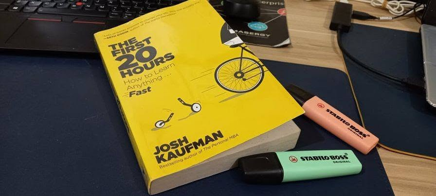

# Libro: The First 20 Hours

*The First 20 Hours: How to Learn Anything... Fast*, by Josh Kaufman

“A problem well stated is a problem half solved.”

Done with another re-read!

What I like about this book is that it makes learning feel less intimidating.

You don't have to become an expert right away.

You don't need to know everything before you start.

You just need to break the skill down, focus on what matters most, and spend enough deliberate time getting past that awkward stage where everything still feels unfamiliar.

That idea alone is pretty useful.

A lot of the time, we make learning harder than it needs to be because we look at the whole mountain instead of the next few steps.

Define what you actually want to learn.

Figure out the most important parts.

Practice those first.

Then keep going.

Simple in theory.

Still takes effort in practice.

But definitely easier than telling yourself you need to master everything before you can even begin.

Might go for *The Martian* next.
