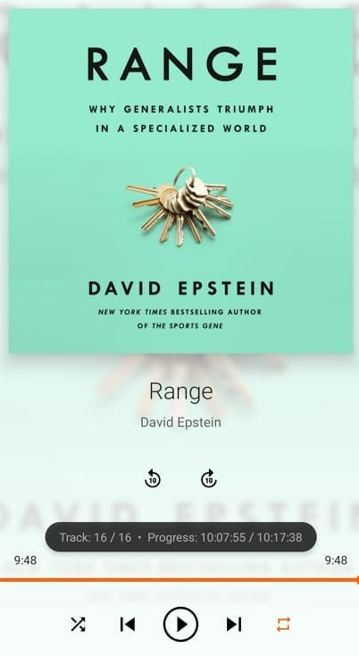

# Libro: Range

*"Great things are not done by impulse, but by a series of small things brought together."*
- Vincent van Gogh

To be a generalist or a specialist?

I used to think you eventually had to pick one.

But after reading *Range* by David Epstein, I think the more interesting answer is that maybe you don't have to rush into choosing at all.

Explore different domains. 

Be curious about things outside your usual lane. 

Try something, leave it, come back to it years later, and sometimes you'll be surprised by how useful those seemingly unrelated experiences become.

And when you do find something that really catches your interest, go deep.

Learn the stack. 

Understand how things work underneath. 

Get good enough at it that you can actually build, break, fix, and explain things.

But you also don't have to spend your entire life with your foot pressed against the gas.

Sometimes you can slow down.

Coast for a while.

Look around.

Try something else.

Then come back with a different perspective.

Maybe being a generalist and being a specialist aren't really opposites. You can explore broadly while still developing depth in the things that matter to you.

And as the world around you changes, some of what you know will become useful, some will become outdated, and some things you'll have to rethink completely.

Learn.

Unlearn.

Then learn again. 

