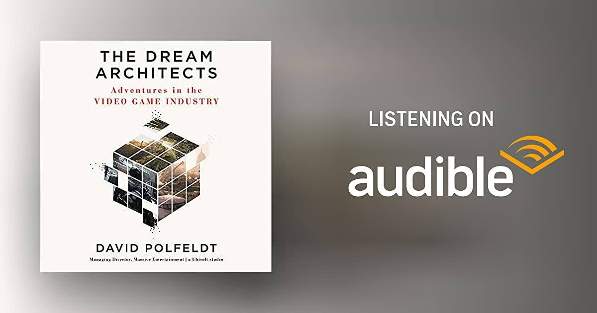

# Libro: The Dream Architects

*The Dream Architects: Adventures in the Video Game Industry*, by David Polfeldt

“Curiosity is the ultimate proof of a mature craftsman.
Understanding that change is good. Knowing that discovering you are wrong means growth.”

One of the things I liked about this book is how much it shows that creative work is rarely a straight line.

Games, like most things worth building, go through revisions, wrong assumptions, failed ideas, changing directions, and plenty of moments where someone has to admit:

**Yeah, this isn't working.**

And I think that takes a certain kind of maturity.

Not just being good at what you do, but staying curious enough to question what you already know.

Being willing to change your mind.

Being comfortable with finding out that your first idea was wrong.

Because being wrong doesn't always mean you failed.

Sometimes it just means you've learned enough to see the problem differently.

And yes, after finishing this, I somehow ended up appreciating the *Avatar* universe even more.

**Oel ngati kameie.**
