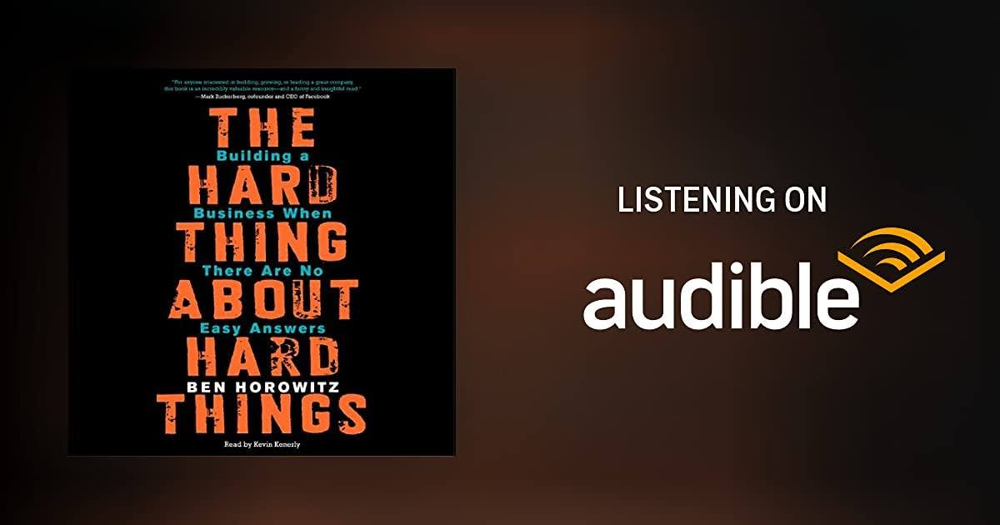

# Libro: The Hard Thing About Hard Things 

Third time finishing this audiobook.

The first time was right out of college. The second was about a year later. And the third was just last week.

What struck me this time, and what I find pretty amazing, is how much my perspective toward the book has changed over the years.

The book itself stayed the same.

I didn't.

The first time I listened to it, a lot of the stories just sounded intense, impressive, and maybe even a little distant from where I was in life. Years later, some of the same parts started to make more sense because I had gone through more work, more uncertainty, more bad decisions, more pressure, and more moments where there really wasn't an obvious answer.

I think that's one of the best things about revisiting a book like this. Sometimes you don't really "outgrow" it. You just finally catch up to parts of it.

Best takeaway?

Ask the really good questions.

And how do you learn to ask really good questions?

By asking a lot of bad ones first.

By being wrong. 

By missing things. 

By asking something obvious. 

By realizing afterward that you should've asked something else entirely.

Eventually, you get better at knowing which questions actually matter.

And yes, sometimes a whole shitload of courage really can clear paths and move mountains.
