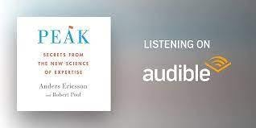

# Libro: Peak

*Peak: Secrets from the New Science of Expertise*, by Anders Ericsson and Robert Pool

All in all, this book is a goldmine of ideas on learning, practice, and improving at something over time.

It also strongly supports the idea of having a **growth mindset**.

We may all start with different talents, abilities, and advantages, but we are not completely defined by them.

You can learn just enough to do what the job requires.

Or you can keep pushing further.

Practice deliberately.

Work on the parts you're bad at.

Stretch beyond what already feels comfortable.

And, given enough time and the right kind of practice, move closer and closer to mastery.

Talent may give you a starting point.

It doesn't have to decide where you finish.
