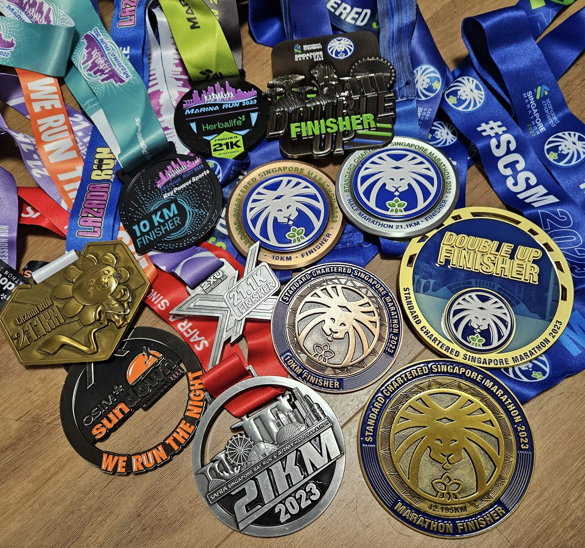

Stepping away from work during the holidays gave me the breathing room to actually sit down and look back at the past year. 

With every distance covered, I ended up learning a lot about myself. 

Out on the pavement, with nothing but your own pacing and breath, things tend to get pretty clear.

The tally for the year:

- Five half marathons (21km)
- One full marathon (42km)
- Countless early mornings and long stretches of road

Here is to 2024. 

May we all embrace both the uncertainty and the joy of the road that lies ahead.