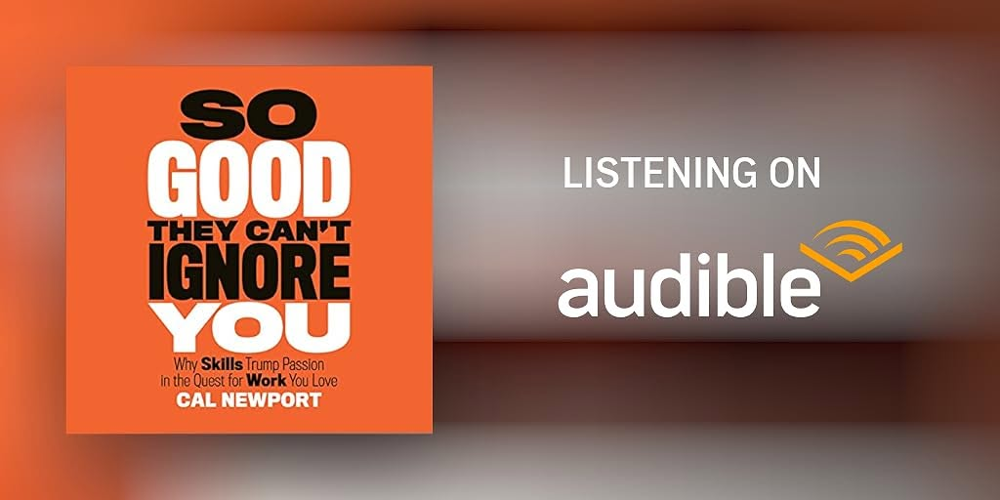

# Libro: So Good They Can't Ignore You

*So Good They Can't Ignore You*, by Cal Newport

Book 2 of 2024

Lots of really good advice in this one, but the idea that stuck with me most was this:

**“Follow your passion” can actually be pretty bad career advice.**

Not because passion is useless, but because at the start of a career, most of us don't really know yet what kind of work will give us the most satisfaction, freedom, or control.

Sometimes passion doesn't come first.

Sometimes competence does.

The book talks about shifting from a **passion mindset** to a **craftsman mindset**.

The passion mindset asks: **What can the world offer me?**

The craftsman mindset asks: **What can I offer the world?**

That difference sounds small, but it changes how you approach work.

Instead of constantly asking whether you've already found the perfect job, the perfect field, or the thing you're “meant” to do, you focus first on becoming really good at something valuable.

Explore different things, even interests that seem indirect or unrelated.

Stretch your abilities beyond what already feels comfortable.

And don't just play around with your craft.

Practice it.

Deliberately.

Push against the areas where you're still weak.

At the beginning of any career, it's difficult to draw a straight line toward the work that will eventually give you the most satisfaction and control. Most of the time, you only figure that out by trying things, developing skills, and paying attention to where those skills start opening doors.

And somewhere along the way, you might not even notice how much better you've become.

But other people will.

Maybe that's the point.

Don't wait until you magically discover something you're passionate about before you start getting good.

Get good at something worth doing.

Passion might catch up later.
